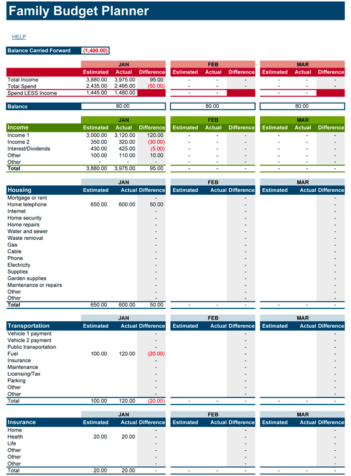

# family-budget-planner-api

REST API for tracking family budget expenses.

- A RESTful API created using Spring Boot.
- I used PostgreSQL as the relational database and JdbcTemplate to interact with that.
- I have used JSON Web Token (JWT) to add authentication. Using JWT, we can protect certain endpoints and ensure that user must be logged-in to access those.

## Setup and Installation

1. **Clone the repo from GitHub**
   ```sh
   git clone 
   cd family-budget-planner-api
   ```
2. **User Docker PostgreSQL database instance**
      ```sh
      docker container run --name postgresdb -e POSTGRES_PASSWORD=password -d -p 5432:5432 postgres
      ```
3. **Create database objects**

   SQL script file (family-budget-planner-db.sql) is present for creating all database objects
    - Copy this file to the running container using below command and then exec into the running container:
      ```
      docker container cp family-budget-planner-db.sql postgresdb:/
      docker container exec -it postgresdb bash
      ```
    - run the script using psql client:
      ```
      psql -U postgres --file family-budget-planner-db.sql
      ```
4. **Project add database configurations in application.properties**

   path src/main/resources/application.properties file accordingly:
   ```properties
   spring.datasource.url=jdbc:postgresql://localhost:5432/familybudgetplannerdb
   spring.datasource.username=postgres
   spring.datasource.password=password
   ```
5. **Run the spring boot application**
   ```sh
   ./mvnw spring-boot:run
   ```
   this runs at port 8080 and hence all enpoints can be accessed starting from http://localhost:8080


6. **Report Page**
